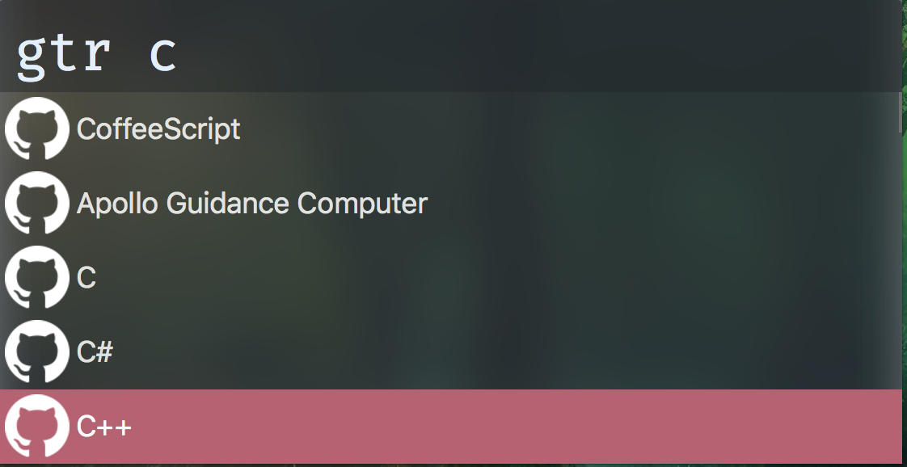
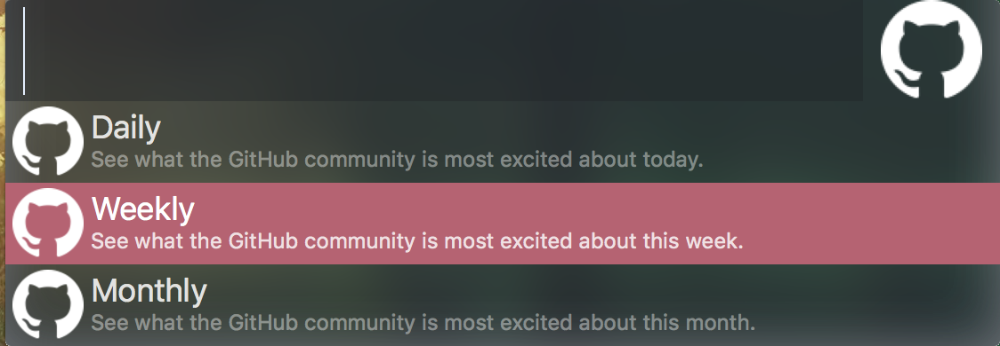
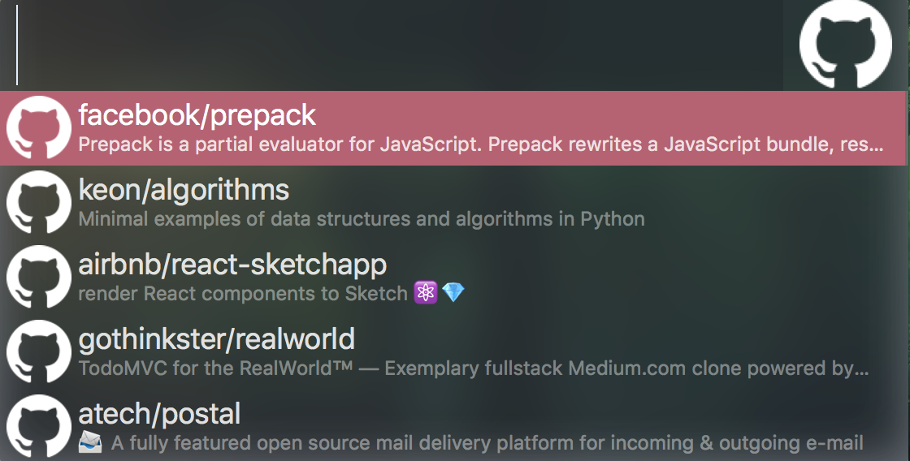

# alfred-github-explorer [](https://travis-ci.org/mikqi/alfred-github-trending)

> Alfred 3 workflow for get trending repo in GitHub

## Install

```
$ npm install --global alfred-github-trending
```

_Requires [Node.js](https://nodejs.org) 4+ and the Alfred 3 [Powerpack](https://www.alfredapp.com/powerpack/)._

## Usage

In Alfred, type `gtr` follow with your query and then press <kbd>Enter</kbd>.



choose your trending periods.



and hold <kbd>alt</kbd> to see repository detail



## Shortcut

`cmd+y` to use quick preview in repositories.

`cmd+l` to see full description about repositories.

`cmd+c` to copy link in focus list.

## License

MIT © [Muhammad Rivki](https://this.rivki.id)
